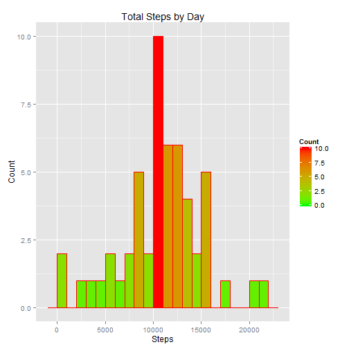
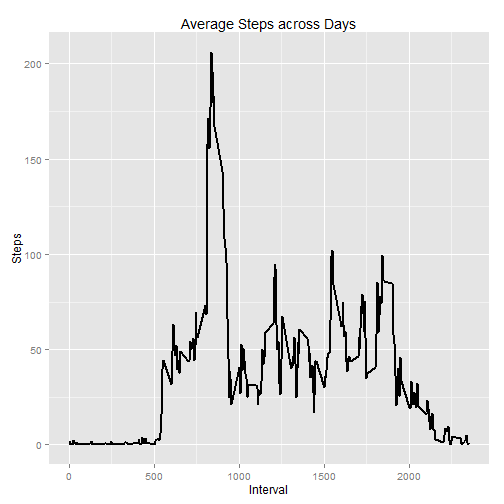
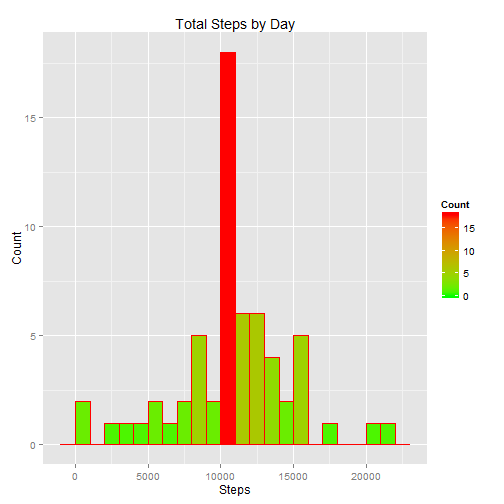
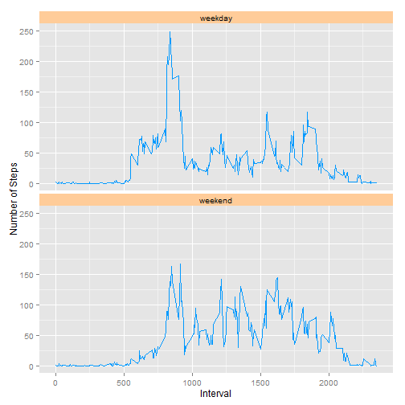

## Are there differences in activity patterns between weekdays and weekends?

## Loading and preprocessing the data


Show any code that is needed to
Load the data (i.e. read.csv())
Process/transform the data (if necessary) into a format suitable for your analysis


```r
act.ds <- read.csv("activity.csv",sep=",",header=TRUE)
```

##What is mean total number of steps taken per day?
For this part of the assignment, you can ignore the missing values in the dataset.

Calculate the total number of steps taken per day


```r
total.steps.by.day <- aggregate(steps ~ date, data=act.ds, sum, na.rm=TRUE)
head(total.steps.by.day,10)
```

```
##          date steps
## 1  2012-10-02   126
## 2  2012-10-03 11352
## 3  2012-10-04 12116
## 4  2012-10-05 13294
## 5  2012-10-06 15420
## 6  2012-10-07 11015
## 7  2012-10-09 12811
## 8  2012-10-10  9900
## 9  2012-10-11 10304
## 10 2012-10-12 17382
```

Make a histogram of the total number of steps taken each day


```r
g <- ggplot(total.steps.by.day, aes(x=steps)) 
g <- g + geom_histogram(binwidth=1000,col="red",aes(fill=..count..))
g <- g + scale_fill_gradient("Count", low = "green", high = "red")
g <- g + labs(x="Steps",y="Count",title="Total Steps by Day")

g
```

 

Calculate and report the mean and median of the total number of steps taken per day


```r
mean.steps.per.day <- mean(total.steps.by.day$steps,na.rm=TRUE)
mean.steps.per.day
```

```
## [1] 10766.19
```

```r
median.steps.per.day <- median(total.steps.by.day$steps,na.rm=TRUE)
median.steps.per.day
```

```
## [1] 10765
```

##What is the average daily activity pattern?

Make a time series plot (i.e. type = "l") of the 5-minute interval (x-axis) and the average number of steps taken, averaged across all days (y-axis)


```r
mean.steps.by.interval <- aggregate(steps ~ interval, data=act.ds, mean,na.rm=TRUE)
head(mean.steps.by.interval,10)
```

```
##    interval     steps
## 1         0 1.7169811
## 2         5 0.3396226
## 3        10 0.1320755
## 4        15 0.1509434
## 5        20 0.0754717
## 6        25 2.0943396
## 7        30 0.5283019
## 8        35 0.8679245
## 9        40 0.0000000
## 10       45 1.4716981
```

```r
g <- ggplot(mean.steps.by.interval,aes(interval,steps))
g <- g + geom_line(size=1)
g <- g + labs(x="Interval",y="Steps",title="Average Steps across Days")

g
```

 

Which 5-minute interval, on average across all the days in the dataset, contains the maximum number of steps?


```r
max <- mean.steps.by.interval[which.max(mean.steps.by.interval$steps),]
max
```

```
##     interval    steps
## 104      835 206.1698
```

##Imputing missing values

Note that there are a number of days/intervals where there are missing values (coded as NA). The presence of missing days may introduce bias into some calculations or summaries of the data.

Calculate and report the total number of missing values in the dataset (i.e. the total number of rows with NAs)


```r
Data.NA <- is.na(act.ds$steps)
sum(Data.NA)
```

```
## [1] 2304
```

Devise a strategy for filling in all of the missing values in the dataset. The strategy does not need to be sophisticated. For example, you could use the mean/median for that day, or the mean for that 5-minute interval, etc.

Create a new dataset that is equal to the original dataset but with the missing data filled in.


```r
# get indexes for all NAs from previous result
all.na.indx <- which(Data.NA)

# put into array from data frame mean.steps.by.interval from previous results
mean.interval <- xtabs(steps ~ interval, mean.steps.by.interval)

# create new dataset from original
act2.ds <- act.ds

# this fill-up all NAs with values from mean 5-min interval
act2.ds$steps[all.na.indx] <- mean.interval[as.character(act2.ds$interval[all.na.indx])]

# should return 0 without NAs
sum(is.na(act2.ds$steps))
```

```
## [1] 0
```

Make a histogram of the total number of steps taken each day and Calculate and report the mean and median total number of steps taken per day.


```r
total2.steps.by.day <- aggregate(steps ~ date, data=act2.ds, sum)

g <- ggplot(total2.steps.by.day, aes(x=steps)) 
g <- g + geom_histogram(binwidth=1000,col="red",aes(fill=..count..))
g <- g + scale_fill_gradient("Count", low = "green", high = "red")
g <- g + labs(x="Steps",y="Count",title="Total Steps by Day")

g
```

 

```r
#mean
mean2.steps.per.day <- mean(total2.steps.by.day$steps)
mean2.steps.per.day
```

```
## [1] 10766.19
```

```r
#median
median2.steps.per.day <- median(total2.steps.by.day$steps)
median2.steps.per.day
```

```
## [1] 10766.19
```

Do these values differ from the estimates from the first part of the assignment? 


```r
# before with NAs
mean.steps.per.day
```

```
## [1] 10766.19
```

```r
median.steps.per.day
```

```
## [1] 10765
```

```r
#after without NAs
mean2.steps.per.day
```

```
## [1] 10766.19
```

```r
median2.steps.per.day
```

```
## [1] 10766.19
```

What is the impact of imputing missing data on the estimates of the total daily number of steps?


```r
print("Answer: Very little impact")
```

```
## [1] "Answer: Very little impact"
```

##Are there differences in activity patterns between weekdays and weekends?

For this part the weekdays() function may be of some help here. Use the dataset with the filled-in missing values for this part.

Create a new factor variable in the dataset with two levels - "weekday" and "weekend" indicating whether a given date is a weekday or weekend day.

Make a panel plot containing a time series plot (i.e. type = "l") of the 5-minute interval (x-axis) and the average number of steps taken, averaged across all weekday days or weekend days (y-axis). 

See the README file in the GitHub repository to see an example of what this plot should look like using simulated data.


```r
act2.ds$weekday <- as.factor(weekdays(as.Date(act2.ds$date)))

levels(act2.ds$weekday) <- list("weekday"="Monday","weekday"="Teusday","weekday"="Wednesday","weekday"="Thursday","weekday"="Friday","weekend"="Saturday","weekend"="Sunday")

mean2.steps.by.interval <- aggregate(steps ~ weekday + interval, data=act2.ds,mean)

g <- ggplot(mean2.steps.by.interval,aes(interval,steps))
g <- g + geom_line(size=0.5,color="#0099FF") + facet_wrap(~weekday,ncol = 1, nrow=2)
g <- g + labs(x="Interval",y="Number of Steps")
g <- g + theme(strip.background = element_rect(fill="#FFCC99"))

g
```

 

Yes, there is a pattern indicating more activities during weekend

